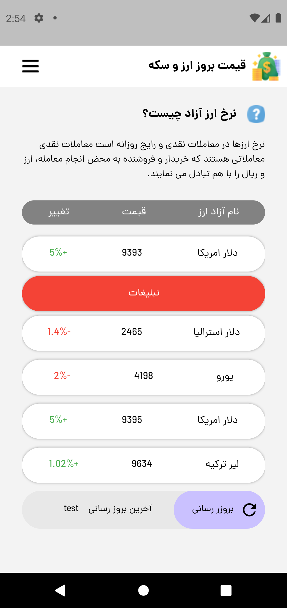

# online_app_for_currency_and_gold_prices

This is the first and a practical project of CodeYad Flutter course.
The goal is to practice UI development and using a simple json file from an API which is programmed by Sasan Safari.

[//]: # (![Screen-Shot]&#40;images/home-screen.png&#41;)

## Getting Started

This project is a starting point for a Flutter application.

A few resources to get you started if this is your first Flutter project:

- [Lab: Write your first Flutter app](https://docs.flutter.dev/get-started/codelab)
- [Cookbook: Useful Flutter samples](https://docs.flutter.dev/cookbook)

For help getting started with Flutter development, view the
[online documentation](https://docs.flutter.dev/), which offers tutorials,
samples, guidance on mobile development, and a full API reference.
